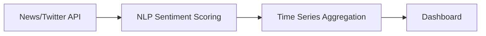

# Atlas — Market Sentiment & Trading Intelligence (Educational Simulation)

[](https://market-sentiment.onrender.com)

> **Disclaimer (read first):** Atlas is an education-only portfolio project. It is **not financial advice**, does **not** place real broker orders, and does **not** trade real money.

Atlas demonstrates how market-news sentiment can be transformed into transparent, explainable signals and evaluated in a **paper-trade style simulation** workflow.

I built this as a **University of Maryland student studying Information Science and Electrical Engineering with a Business minor**.

## What Atlas demonstrates
- Sentiment analysis pipeline design from ingestion to ticker-level signal output.
- Data engineering patterns for structured ingest, normalization, and API-serving.
- Explainable strategy logic (source weighting, time decay, confidence metadata).
- Full-stack product communication via FastAPI backend + React/TypeScript UI.
- Simulation-first framing that avoids claiming broker-connected execution.

## Screenshots


## Data Pipeline



## Data sources and realism
Atlas includes demo data and demo workflows intended for portfolio evaluation:

- `data/sample_news.json` → **static sample dataset** checked into the repo.
- `data/sample_prices.csv` → **static sample dataset** checked into the repo.
- `/api/v1/news/ingest-and-score` → ingests and scores sample/synthetic inputs in local runs.
- Backtesting + paper-trade endpoints → **simulation outputs**, not real fills or brokerage records.

In short: Atlas analyzes sample or delayed-style inputs for educational simulation, not live production trading.

## Tech Stack

| Component | Technology | Purpose |
|---|---|---|
| Backend API | FastAPI, Pydantic, SQLAlchemy | Serve sentiment, watchlist, and backtesting endpoints |
| NLP & Analytics | Python, pandas, NumPy | Sentiment scoring, aggregation, and trading metrics |
| Frontend | React, TypeScript, Vite | Interactive dashboard for market intelligence views |
| Data Storage | SQLite (default), PostgreSQL (optional) | Persist watchlists, sentiment outputs, and simulation state |
| Quality & CI | pytest, ruff, GitHub Actions | Linting, smoke tests, and continuous integration checks |

## Supported Tickers
- `AAPL`
- `TSLA`
- `MSFT`
- `SPY`

## Architecture
- High-level system view: `docs/architecture.md`
- API surface: `docs/api.md`
- Demo narrative/runbook: `docs/demo-runbook.md`

Core flow: **News → NLP → Signal → Simulation**

## Run locally
Clone + install:
```bash
git clone https://github.com/RyanJBush/Real-time-market-sentiment-and-trading-intelligence-platform.git
cd Real-time-market-sentiment-and-trading-intelligence-platform
cd backend && pip install -r requirements.txt && cd ..
```

### 1) Load sample data (demo-only)
```bash
python backend/scripts/seed_demo.py
```

### 2) Run backend demo API
```bash
bash scripts/run_demo.sh
```

### 3) Run UI dashboard (optional)
```bash
cd frontend && npm ci && npm run dev
```

## Demo workflow (5-minute walkthrough)
1. Confirm service readiness (`/health`).
2. Trigger ingest-and-score for sample news.
3. Inspect analytics overview and ticker signals.
4. Run backtesting/paper-trade endpoints as simulation examples.
5. Reiterate: this project demonstrates engineering and analysis, not live execution.

See `docs/demo-runbook.md` for the command sequence.

## Portfolio Preview and screenshots
- **Portfolio Preview:** `docs/preview/index.html`
- Screenshot index and capture guidance: `docs/screenshots/README.md`
- Existing captures:
  - `docs/screenshots/01-dashboard.png`
  - `docs/screenshots/02-news-feed.png`
  - `docs/screenshots/03-signal-output.png`
  - `docs/screenshots/04-backtest-result.png`
  - `docs/screenshots/05-api-docs.png`

## Demo `.env` variables (no real credentials)
- Backend demo settings: `backend/.env.example`
- Frontend demo settings: `frontend/.env.example`

These variables are for local simulation and API wiring only. Do not use or store brokerage/API trading credentials in this project.

## Limitations and future work
### Current limitations
- Demo datasets are static/sample and do not represent high-frequency market infrastructure.
- No broker integration or real order-routing is implemented.
- Outputs are intended for educational analysis and software demonstration.

### Future work
- Add configurable dataset adapters (clearly labeled by freshness and source).
- Expand model evaluation and drift-monitoring instrumentation.
- Improve scenario controls and explainability visualizations in the UI.

## Resume bullets
- See: `docs/resume-bullets.md`

## License
This repository is licensed under `LICENSE`.

**Keywords:** sentiment-analysis, nlp, fintech, trading, time-series, fastapi, python, market-data
